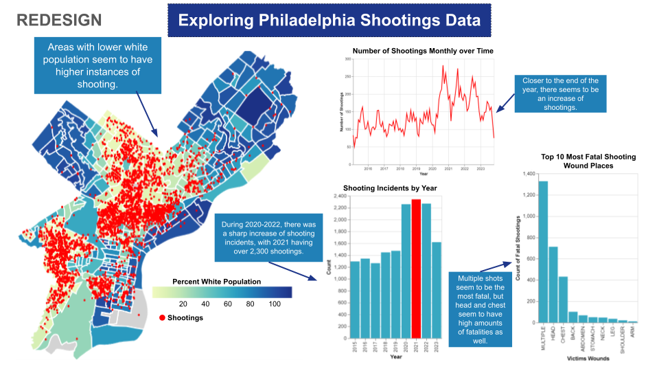

# Philadelphia Shootings Dashboard Redesign

## Overview
A redesign of a public safety dashboard to improve visual cohesion and storytelling. This project analyzes shooting incident patterns in Philadelphia through spatial analysis and temporal trend visualization.

## Final Dashboard Design

*Final redesigned dashboard showcasing improved visual cohesion, strategic annotations, and consistent styling.*

---
# Project Navigation

### **1. Read the Case Study (Start Here)**

<a target="_blank" href="https://github-readme-medium-recent-article.vercel.app/medium/@shho8487/2">  

**This is the best place to start.** The case study walks you through the full design process, from the original critiques to the final redesign and key takeaways.

### **2. Explore the Code & Analysis**

*For best results, run this notebook in Google Colab. GitHub only displays static code.**

*Browse the repository structure and technical implementation.*

---

## Key Findings
- **200% increase** in shootings from 2017-2021
- **Spatial correlation** between shooting density and neighborhood demographics
- **Most fatal wounds:** Multiple injuries, head, and chest wounds

## Tools Used
- **Python** (Pandas, GeoPandas, Requests)
- **Data Visualization** (Altair, Matplotlib)
- **Spatial Analysis** (GeoJSON, Choropleth Mapping)
- **Jupyter Notebook** / **Google Colab**

## Data Sources
All data is from public data sources:
-   **Shooting Incidents:** OpenDataPhilly
-   **Neighborhood Boundaries:** OpenDataPhilly
-   **Demographic Data:** U.S. Census Bureau
